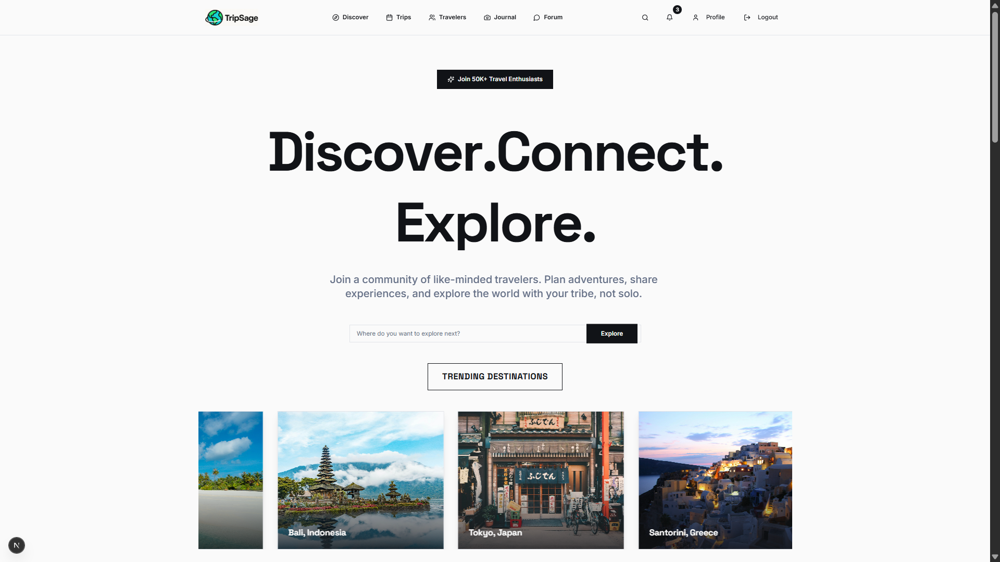
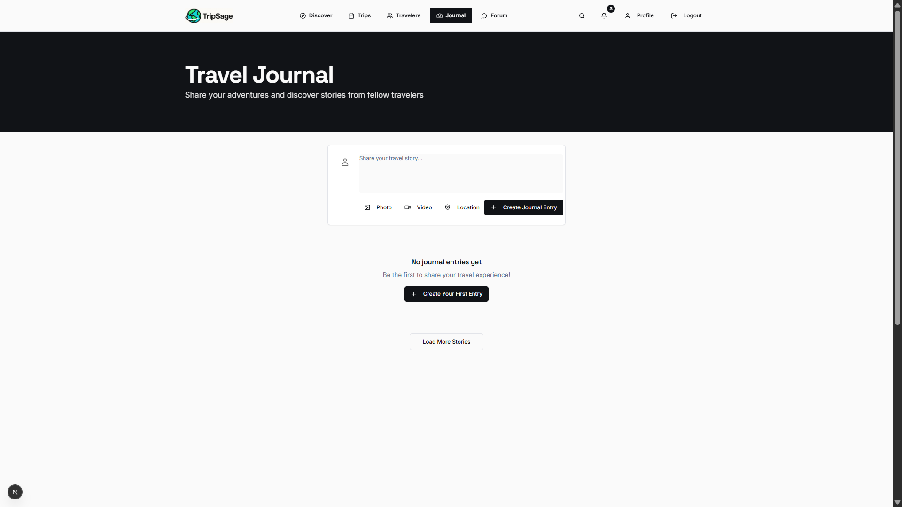
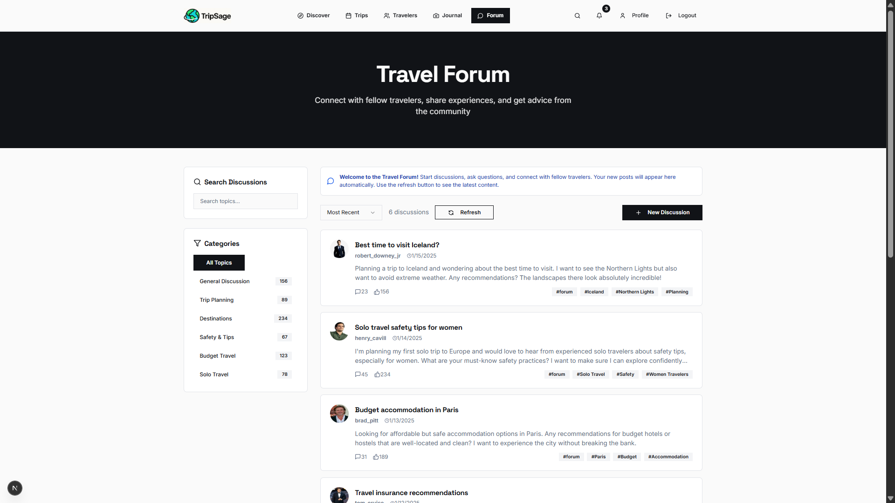

# TripSage 🌍✈️

**Where travelers connect, share stories, and discover the world together.**

TripSage is a travel community platform that brings together wanderers from around the globe. Whether you're planning your next adventure, sharing memories from past trips, or looking for travel companions, this is your digital home base.

## What is TripSage? 🤔

Think of TripSage as a social network for travelers. It's where you can:
- **Share your travel stories** with photos and detailed experiences
- **Ask questions** about destinations, planning, or travel tips
- **Connect with fellow travelers** who share your interests
- **Find travel companions** for your next adventure
- **Discover new places** through other travelers' experiences

## Key Features ✨

### 📖 Travel Journal
Share your adventures with rich storytelling, photos, and location details. Your travel memories become inspiration for others.

### 💬 Travel Forum
Get advice, ask questions, and participate in discussions about destinations, planning, budgeting, and everything travel-related.

### 👥 Community
Connect with travelers worldwide, follow their journeys, and build meaningful connections with people who share your passion for exploration.

### 🎯 Smart Matching
Find travel companions based on destination, dates, and travel style preferences.

## Screenshots 📸

### Home Page


### Travel Journal


### Community Forum


## Getting Started 🚀

1. **Clone the repo**
   ```bash
   git clone https://github.com/Hemuu24/Tripsage.git
   cd Tripsage
   ```

2. **Install dependencies**
   ```bash
   npm install
   ```

3. **Set up your environment**
   - Create a `.env.local` file
   - Add your Supabase credentials
   - Set up your database

4. **Run the app**
   ```bash
   npm run dev
   ```

## Tech Stack 🛠️

Built with modern web technologies:
- **Next.js** for the frontend framework
- **Supabase** for authentication and database
- **Tailwind CSS** for styling
- **TypeScript** for type safety

## The Story Behind TripSage 📚

TripSage was born from the idea that travel is better when shared. Every traveler has unique experiences, insights, and stories that can help others discover the world. Whether you're a solo backpacker, a family vacation planner, or a luxury traveler, there's a place for you in our community.

## Join the Community 🌟

Ready to start sharing your travel adventures? Sign up and become part of a global community of explorers, storytellers, and adventure seekers.

---

*Built with ❤️ for travelers everywhere*

<!-- Last updated: August 10, 2025 -->
